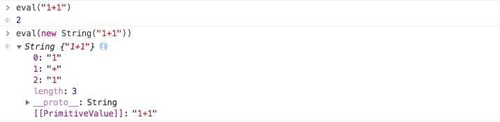

# 未整理内容

## js 中的基本字符串和字符串对象

基本字符串和字符串对象是两个概念，

```js
let a = '111', //  这叫做基本字符串
let b = new String('2222') // 这叫做字符串对象
```

当 **基本字符串** 调用 String 相关方法的时候，实际上是被 **转换成了字符串对象** 后才执行方法的。

如果使用 eval 分别执行基本字符串和字符串对象，结果是不同的



使用 valueOf 方法，可以把字符串对象转成基本字符串

```js
console.log(eval(s2.valueOf())); // returns the number 4
```

## String.prototype.length

返回字符串的长度

## String.prototype.charCodeAt

返回字符的 unicode 码位，该码位是 16 进制表示的，但是只能表示第 1 个字符平面内的字符，也就是说只能返回 0~65535 之间的数值，如果遇到一些不在第 1 平面的字符，需要需要加上该字符第二个编码单元。具体的编码算法可以查看[Unicode 与 ASCII 码的关系](../unicode-ascii/index.md);

