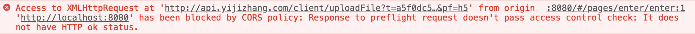

<!-- Date: 2020-09-23 15:20 -->

# ajax 提交 POST 数据时，返回`it dose not have http status`错误

```
后端：PHP+CI4
前端：UNI-APP
```

如图所示：



这个图的意思是，当前请求在“预请求”的古城中，没有通过服务器的访问控制规则

关于**预请求**可以参考[预请求说明文档](https://developer.mozilla.org/zh-CN/docs/Glossary/Preflight_request)和[OPTIONS 请求文档](https://developer.mozilla.org/zh-CN/docs/Web/HTTP/Methods/OPTIONS)

这里只说解决办法

```php
$method = $_SERVER['REQUEST_METHOD'];
if ($method == 'OPTIONS') {
    pp();  // pp 是我分装的结束函数，用来处理返回给前端的各种数据，里面有 die;
}
```

我这里如果发现请求方式是`options`说明收到了预请求，就直接结束进程返回了，也可以根据实际情况处理某些操作。
