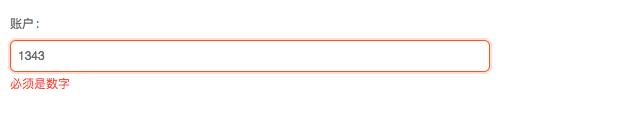
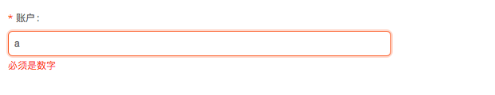
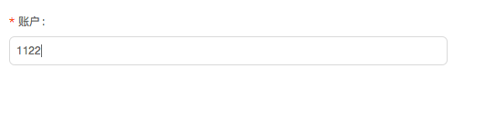
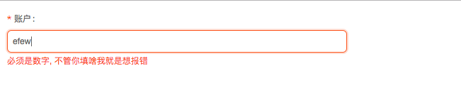
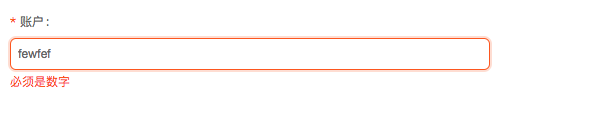
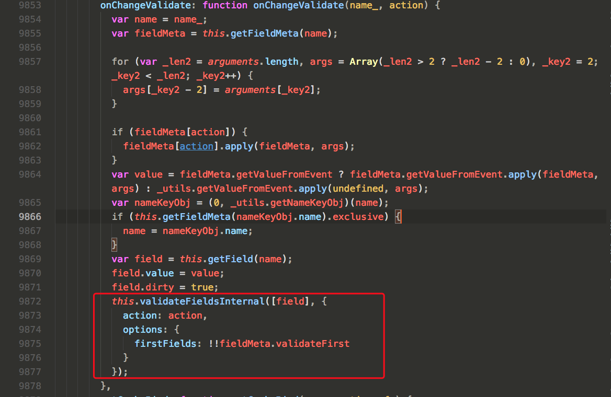
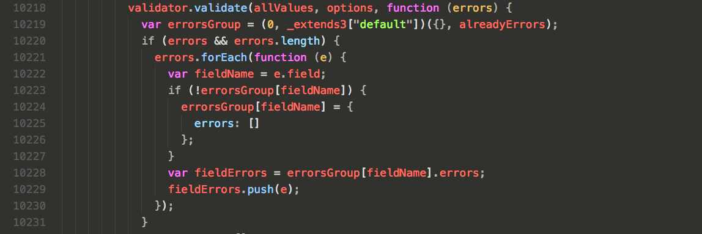

<!-- Date: 2017-08-29 11:35:22 -->

# antd 表单中的验证规则

> demo 运行方式： npm run dev

antd 表单验证过程中出现了两个问题

- 官方案例无法验证输入内容为 number
- rules 中包含自定义的 validator 时，未通过的验证规则抛出的错误提示会同时显示

先说第一个，官方案例如下

```js
<FormItem label="账户">
  <Input
    placeholder="请输入账户名"
    {...getFieldProps('userName', {
      validateFirst: true,
      rules: [
        {
          type: 'number',
          message: '必须是数字',
        },
      ],
    })}
  />
</FormItem>
```



从页面上可以看出，明明已经输入数字，还是显示了错误的 message。正确的写法如下

```js
<FormItem label="账户">
  <Input
    placeholder="请输入账户名"
    {...getFieldProps('userName', {
      validateFirst: true,
      rules: [
        {
          required: true,
          pattern: /^\d+$/,
          message: '必须是数字',
        },
      ],
    })}
  />
</FormItem>
```





现在已经是我们想要的结果了。

第二个问题： 当页面出现自定义 validator 的时候，未通过的验证规则抛出的错误提示会同时显示，这是什么意思呢？先看下面案例

```js
<FormItem label="账户">
  <Input
    placeholder="请输入账户名"
    {...getFieldProps('userName', {
      rules: [
        {
          required: true,
          message: '不能为空',
        },
        {
          type: 'string',
          pattern: /^\d+$/,
          message: '必须是数字',
        },
        {
          validator(rules, value, cb) {
            cb('不管你填啥我就是想报错');
          },
        },
      ],
    })}
  />
</FormItem>
```



从页面中可以看出第 2、3 的验证规则都没通过，且这两个 message 都出现在页面上了，要知道这些验证规则只要一个不能通过，后面的规则不再执行，才是最省时省力的方法，那么如何实现这个目的呢？

antd 上关于 getFieldProps 的 option 选项有一个隐藏的参数并没有在文档上显示，那就是`validateFirst`。

当`validateFirst: true`的时候，在一个规则校验失败的时候，就会直接抛出错误，不再校验剩余的规则。

然而我在使用的时候 antd 的文档上并没有写明这个参数

```js
<FormItem label="账户">
  <Input
    placeholder="请输入账户名"
    {...getFieldProps('userName', {
      validateFirst: true, //  对的， 就是多了这个属性
      rules: [
        {
          required: true,
          message: '不能为空',
        },
        {
          type: 'string',
          pattern: /^\d+$/,
          message: '必须是数字',
        },
        {
          validator(rules, value, cb) {
            cb('不管你填啥我就是想报错');
          },
        },
      ],
    })}
  />
</FormItem>
```



那么加了这个参数有什么用呢？从源码中可以看到，加的这个参数，最终相当于`async-validator`中`validate(source, options, callback)`方法的 options.firstField 属性。我在使用的时候，用的是`antd1.5.1`版本，源码在`dist/antd.js`中第`9853~9878`以及`10174~10268`行之间，实际调用方法在`10218`行，有兴趣的可以去源码中逆向找一下。





本文完整案例查看[antd-demo](./demo)中的 FormApp 组件。

## 特殊案例

打开本文[demo](./demo)中的 CheckApp 组件

需求:

> 只有输入框前面的多选框为 checked 的时候，才可以输入，并且在提交的时候通过某些校验规则

问题：

打开页面第一次点击提交，这个时候两个 checked 的状态都为 false，不需要校验 input，所以控制台输出`errors:null`,

打开每日库存，按照规则，在点击提交按钮的时候，是需要对输入框进行校验的，但是并没有触发定义好的 validator，仍然控制台输出`errors: null`

找出原因：

antd 中触发校验器的默认方式有两种：

1.  onChange 事件
2.  第一次的 onSubmit 事件，而且第一次 onSubmit 事件之后，控件的 error 会被保存下来，直到下一次 onChange 事件才能重新触发校验，后续的 onSubmit 事件都不会再次触发已有 error 的校验器。

解决问题：

所以，在案例中，第一次 onSubmit 事件之后，我们需要模拟触发一次输入控件的 onChange 事件，来重新运行输入控件的校验器。

因此，我们可以在 checkbox 控件上，添加一个 onChange 事件，并且通过`setFieldValue()`方法，来修改对应 input 的值，达到模拟触发 input 的 onChange 事件。

至此问题解决完毕！

> 可以通过打开[demo](./demo/src/checkApp.jsx)文件中第 35 和 73 行的注释来查看前后的不同
