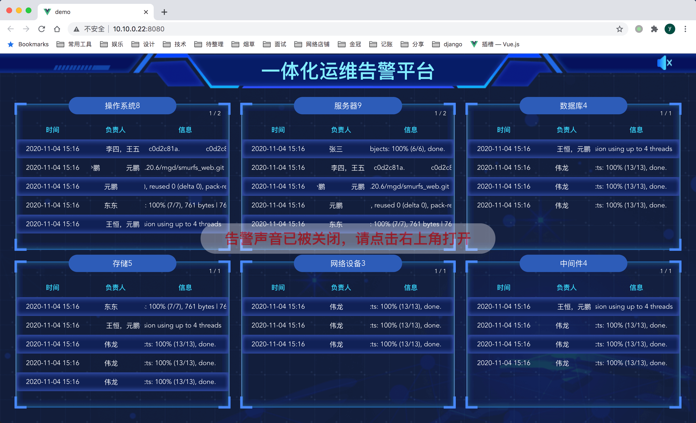

<!-- Date: 2020-11-09 10:44 -->

# vue 实例：运维大屏

## 查看方式

1. 进入 demo 目录
2. 执行`npm install && npm run serve`

## 需求详情

1. 一次请求拿到所有数据，前端处理每隔 10 秒翻页
2. 翻页结束后，自动请求下一批数据
3. 如果数据总数发生变化，高亮显示标题和数量
4. 根据窗口大小自动调整每页显示的数量
5. 负责人和信息栏，要求内容重复滚动显示

## 根据窗口大小自动调整每页显示的数量

获取列表元素的高度，除以每行的额定高度，算出每页可先显示条数

## 负责人和信息栏，要求内容重复滚动显示

参考另外一篇文章
