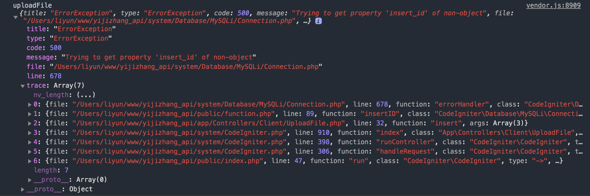

<!-- Date: 2020-09-23 14:25 -->

# CI4 中自动获取插入数值的自增 ID 值报错问题

手头有个使用 CI4 的项目，为了方便查询，在 CI 的基础上，手动封装了`insert`语句。本着希望返回每次插入新值的自增 ID，是这么写的：

```php
function insert($table, $data)
{
    global $db;
    // 这没有直接执行，而是使用getCompiledInsert组装成一个sql语句，是为了把sql语句写到日志中
    $sql = $db->table($table)->set($data)->getCompiledInsert();
    query($sql); // query是另一个封装过的用于执行sql语句的函数
    return $db->insertID();
}
```

实际执行的时候，竟然报了一个错误



他说没有找到`insert_id`这个属性。查看了下 CI 的源码`system/Database/MySQLi/Connection.php`，发现了这玩意儿

```php
/**
    * Insert ID
    *
    * @return integer
    */
public function insertID(): int
{
    return $this->connID->insert_id;
}
```

也就是说，`insertID()`方法只是把已经保存在当前实例的`insert_id`返回出来了而已，那么这个值肯定是在某个特定时间设置的，按照之前我的写法，`insert`语句是被`query`函数执行的，很明显`query`函数在执行`insert`语句时，并没有在执行后自动设置`insert_id`的值，所以在取值的时候，就报错了。

CI4 还提供了一个直接执行`insert`语句的方法，做如下改动：

```php
function insert($table, $data)
{
    global $db;
    // 这里只是为了打印sql语句
    $sql = $db->table($table)->set($data)->getCompiledInsert();
    logs($sql);
    // 这里的insert方法会直接组装并执行sql语句
    $db->table($table)->set($data)->insert();
    return $db->insertID();
}
```

再试一下，果然完美的返回了自增 ID 值。看来 CI 中只有直接执行`insert`的时候，才会自动更新实例中的`inset_id`属性值
