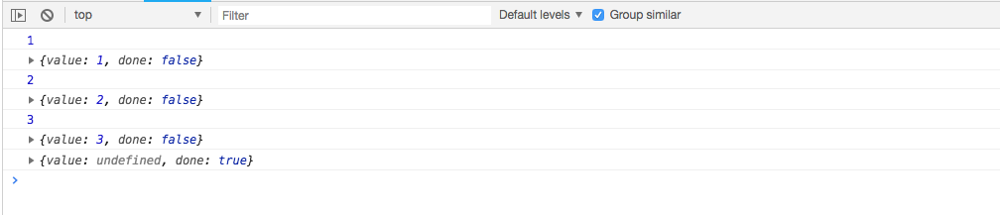
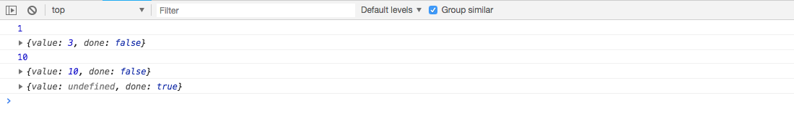

# es6-Generator 遍历器对象生成函数

> 本文所有代码均可以直接复制到浏览器控制台查看

Generator 是 ES6 新提供的一种异步解决方案，在[es6-iterator 遍历器](../es6-iterator)文中定义了一个模拟返回遍历器对象的方法

```js
function makeIterator(arr) {
  let index = 0,
    len = arr.length;
  return {
    next: function() {
      if (index < len) {
        index++;
        return {
          done: false,
          value: arr[index - 1],
        };
      } else {
        return {
          done: true,
          value: undefined,
        };
      }
    },
  };
}
```

generator 函数实际上可以看做是一个更直观、简单、快捷的遍历器函数。函数执行后，也返回了一个"遍历器对象"。

generator 函数有两个明显的特征：

- 1：函数名前面有`*`号
- 2：函数内部有`yeild`关键字,定义了不同的状态。

```js
function* add(){
	yeild 1;
	yeild 2;
	return 3;
}
```

`*`的位置目前没有规定,只要放在`function`与函数名之间即可。

## 函数内的 yield 表达式

`yield`后面可以直接跟一个值，也可以跟随一个表达式

```js
function* add() {
  yield 1 + 1;
  yield 'a' + 'b';
  yield true ? 1 : 2;
}
```

`yield`后面表达式的值，会成为遍历器对象执行`next()`方法后返回对象中属性`value`的值。

## 函数内的 return 语句

`return`语句和以往的`return`是相同的，与`yield`的区别主要体现在使用`next`方法和`for...of...`语句的结果上。

`return`后面的值，可以被`next()`方法获取到，却不能被`for...of...`遍历出来

```js
function* add(){
	yeild 1;
	yeild 2;
	yeild 3;
	return 4;
}
let it = add();
console.log(it.next()); // {value: 1, done: false}
console.log(it.next()); // {value: 2, done: false}
console.log(it.next()); // {value: 3, done: false}
console.log(it.next()); // {value: 4, done: true}
console.log(it.next()); // {value: undefined, done: true}

let it2 = add();
for (let item of it2) {
  console.log(item);
}
// 1
// 2
// 3
```

这是因为在遇到`done`为`true`的时候, `for...of...`会自动停止遍历。而`next()`会持续读取当前的状态。

## 遍历器对象的 next 方法

遍历器对象可以执行`next()`方法，每执行一次，会返回遍历器对象中的一个状态。这个状态是一个包含了`value`和`done`属性的对象。

`value`的内容是 `yeild` 表达式后面的值，而 `done` 保存了遍历器对象的状态。来表示是否遍历完成。我们也可以把这种返回每个状态对应的结果的案例称作“状态机”.当 `done` 为 `true` 的时候，表示遍历器对象中保存的状态已经全部读取完毕。

```js
function* add() {
  console.log(1);
  yield 1;
  console.log(2);
  yield 2;
  console.log(3);
  yield 3;
}
let it = add();
console.log(it.next()); // {value: 1, done: false}
console.log(it.next()); // {value: 2, done: false}
console.log(it.next()); // {value: 3, done: false}
console.log(it.next()); // {value: undefined, done: true}
```



上面案例中每一次`next`方法，都会在遇到下一个`yield`语句暂停执行，直到下一次`next()`的时候恢复执行代码[查看完整代码](./demo/demo2.html)

如果 generator 函数中含有 return 语句，`next()`会把`return`的值，当做这次状态中`value`的值，且这次的`done`设置为`true`，后续的`next()`始终返回`{value: undefined, done: true}`

```js
function* add() {
  console.log(1);
  yield 1;
  console.log(2);
  yield 2;
  console.log(3);
  return 3;
}
let it = add();
console.log(it.next()); // {value: 1, done: false}
console.log(it.next()); // {value: 2, done: false}
console.log(it.next()); // {value: 3, done: true}
console.log(it.next()); // {value: undefined, done: true}
```

## 带有参数的 next 方法

如果一个变量的值中包含了`yield表达式`，`next()`方法只会执行到对应 yield 表达式的结束，声明的变量需要在下一次`带有参数的next()`时才能被赋值 [查看完整代码](./demo/demo3.html)

```js
function* add() {
  let a = yield 1 + 2;
  yield a;
}
let it = add();
console.log(it.next()); // {done: false, value: 3}
console.log(it.next(10)); // {done: false, value: 10}
console.log(it.next()); // {done: true, value: undefined}
```



上面的案例中，第二次`next`方法，我传递了一个参数 10 进去，所以变量`a`的值就是 10，`next`方法执行后的返回内容也就变成了`{value: 10, done: false}`.

如果不传递参数，`next()`的结果就会成为`{value: undefined, done: false}`

```js
function* add() {
  let a = yield 1 + 2;
  yield a;
}
let it = add();
console.log(it.next()); // {done: false, value: 3}
console.log(it.next()); // {done: false, value: undefined}
console.log(it.next()); // {done: true, value: undefined}
```

## 遍历器对象的 return 方法

当遍历器对象执行`return()`方法的时候，相当于提前结束了遍历。返回的对象中，`value`为`return()`方法的参数，`done`为`true`;并且下一次的`next()`返回值始终为`{done: true, value: undefined}`

```js
function* add() {
  yield 1;
  yield 2;
  yield 3;
  yield 4;
}

let it = add();
console.log(it.next()); // {value: 1, done: false}
console.log(it.return(5)); // {value: 5, done: true}
console.log(it.next()); // {value: undefined, done: true}
```

当函数内有`try...finally...`语句，且函数`已经进入try的代码块内`，`遍历器的return()`方法会在`finally`执行后再执行

```js
function* add() {
  yield 1;
  try {
    yield 2;
  } finally {
    yield 3;
  }
  yield 4;
}
let it = add();
console.log(it.next()); // {done: false, value: 1}
console.log(it.return(5)); // {done: true, value: 5}
console.log(it.next()); // {done: true, value: undefined}
```

上面的案例中`return()`方法依然提前结束了遍历，是因为代码还没进入`try`代码块

```js
function* add() {
  yield 1;
  try {
    yield 2;
  } finally {
    yield 3;
  }
  yield 4;
}
let it = add();
console.log(it.next()); // {done: false, value: 1}
console.log(it.next()); // {done: false, value: 2}
console.log(it.return(5)); // {done: false, value: 3}
console.log(it.next()); // {done: true, value: 5}
console.log(it.next()); // {done: true, value: undefined}
```

## 遍历器对象的 throw 方法

`遍历器对象的throw`方法，可以用来在`函数体外`抛出一个错误，并和`next()`一样返回下一个状态

```js
function* add() {
  yield 3;
  yield 4;
  yield 5;
}
var it = add();
console.log(it.next()); // {value: 3, done: false}
try {
  console.log(it.throw('throw方法抛出的错误')); // {value: 4, done: false}
} catch (e) {
  console.log(e); // “throw方法抛出的错误”
}
console.log(it.next()); // {value: 5, done: false}
console.log(it.next()); // {value: undefined, done: true}
```

如果函数体内有`try...catch...`语句，会被函数体内的`catch`捕捉。和`throw`命令一样，它的参数会传递给`catch`语句

```js
function* add() {
  try {
    yield 1;
  } catch (e) {
    console.log(e); //  "throw方法抛出的错误"
  }
  yield 2;
}
var it = add();
console.log(it.next()); // {value: 1, done: false}
console.log(it.throw('throw方法抛出的错误')); // {value: 2, done: false}
console.log(it.next()); // {value: undefined, done: true}
```

如果函数内部没有部署`try...catch...`语句，`throw方法`抛出的错误会被函数体外的`catch`捕获

```js
function* add() {
  yield 1;
  yield 2;
}
var it = add();
console.log(it.next()); // {value: 1, done: false}
try {
  console.log(it.throw('throw方法抛出的错误')); // {value: 2, done: false}
} catch (e) {
  console.log(e); // “throw方法抛出的错误”
}
console.log(it.next()); // {done: true, value: undefined}
```

如果函数体内和函数体外都没有部署`try...catch`语句，`throw方法`抛出的错误将会暴露给执行环境，并且终止执行

```js
function* add() {
  yield 1;
  yield 2;
}
var it = add();
console.log(it.next()); // {value: 1, done: false}
console.log(it.throw()); // {value: 2, done: false}
console.log('不会执行这一句'); // 由于抛出的错误没有捕获语句接收，这里不会输出任何东西
```

函数体内`throw语句`抛出的错误，如果没有放在函数内部的`try...catch...`语句中，被 `catch`捕获，遍历器会立即提前结束，并在下一次`next()`返回`{done: true, value: undefined}`[查看完整代码](./demo/demo4.html)

```js
function* add() {
  yield 1;
  throw new Error('函数内部抛出的错误');
  yield 2;
}
var it = add();
console.log(it.next()); // {value: 1, done: false}
try {
  console.log(it.next()); // 由于函数内部抛出了错误，且没有内部捕获这句不会进行任何输出
} catch (e) {
  console.log(e); // "函数内部抛出的错误"
}
console.log(it.next()); // {done: true, value: undefined}
```

## Generator 函数与 Iterator

generator 函数执行后会返回一个遍历器对象，所以我们完全可以用 Genrator 函数来为对象部署遍历器属性。

```js
var obj = {
  *[Symbol.iterator]() {
    yield 1;
    yield 2;
    yield 3;
  },
};
```

对 obj 对象设置了一个遍历器接口之后，我们就可以在`obj`对象上使用`for...of..., 扩展运算符...`了

```js
for (item of obj) {
  console.log(item);
}
// 1
// 2
// 3

var a = [...obj, 4, 5, 6]; //  [1, 2, 3, 4, 5, 6]
```

当然了也可以用在任何一个接受`可迭代对象`作为参数的方法中，这里不再举例，详细的可以参考[es6-iterator](../es6-iterator)一文中的"接收可迭代对象作为参数的方法"。

## generator 函数的嵌套

如果使用`yield*`后面加一个遍历器对象，执行`next()`的时候，会深入到遍历器对象的内部执行

```js
function* out() {
  yield 1;
  yield 2;
}
function* add() {
  yield* out();
  yield 3;
}
var it = add();
console.log(it.next()); // {value: 1, done: false}
console.log(it.next()); // {value: 2, done: false}
console.log(it.next()); // {value: 3, done: false}
console.log(it.next()); // {value: undefined, done: true}
```

如果`yield`后面没有加`*`星号，则会直接把遍历器对象本身作为`value`的值

```js
function* out() {
  yield 1;
  yield 2;
}
function* add() {
  yield out();
  yield 3;
}
var it = add();
console.log(it.next()); // {value: out, done: false}
console.log(it.next()); // {value: 3, done: false}
console.log(it.next()); // {value: undefined, done: true}
```

所有的`可迭代对象`都可以使用`yield*`来遍历

```js
function* add() {
  yield 'orange';
  yield* 'pear';
}
var it = add();
it.next(); // {value: 'orange', done: false}
it.next(); // {value: 'p', done: false}
it.next(); // {value: 'e', done: false}
it.next(); // {value: 'a', done: false}
it.next(); // {value: 'r', done: false}
it.next(); // {value: undefined, done: false}

function* add() {
  yield [1, 2, 3];
  yield* [1, 2, 3];
}
var it = add();
it.next(); // {value: [1,2,3], done: false}
it.next(); // {value: 1, done: false}
it.next(); // {value: 2, done: false}
it.next(); // {value: 3, done: false}
it.next(); // {value: undefined, done: false}
```

当`yield*`语句后面跟着的 generator 函数中有`return语句`的时候，`next()`方法不再把`return`语句的值作为一次状态返回，而是直接作为整个`yield*语句`的返回值。

```js
function* out() {
  yield 1;
  yield 2;
  return 10;
}
function* add() {
  var a = yield* out();
  yield 3;
  return a;
}
var it = add();
console.log(it.next()); // {done: false, value: 1}
console.log(it.next()); // {done: false, value: 2}
console.log(it.next()); // {done: false, value: 3}
console.log(it.next()); // {done: false, value: 10}
console.log(it.next()); // {done: true, value: undefined}
```
