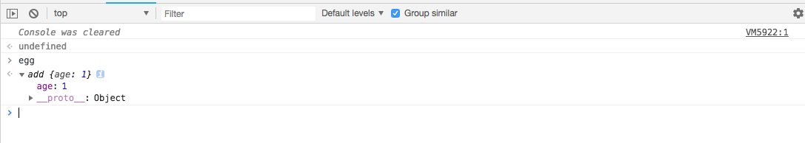

<!-- Date: 2018-07-13 12:11 -->

# es6 代理对象的拦截器属性-construct

当被代理对象是一个构造函数的时候，`construct`属性，用于拦截`new`表达式，且`必须`返回一个对象。

-   `target`表示被代理的对象
-   `argList`表示执行函数式传入的参数，以数组形式传递
-   `newTarget`表示代理对象自身

## 拦截案例

```js
let add = function () {
    this.age = 1;
};
let proxy = new Proxy(add, {
    construct: function (target, argList, newTarget) {
        console.log(target === add); // true
        console.log(argList); // [1,2,3]
        console.log(newTarget === proxy); // true
        return new target();
    },
});
let egg = new proxy(1, 2, 3);
console.log(egg);
```



## 错误案例

`construct`属性，必须返回一个对象，当返回值不是一个对象的时候，会抛出错误

```js
let add = function () {
    this.age = 1;
};
let proxy = new Proxy(add, {
    construct: function (target, argList, newTarget) {
        return 1;
    },
});
let egg = new proxy(1, 2, 3);
// Uncaught TypeError: 'construct' on proxy: trap returned non-object ('1')
```
