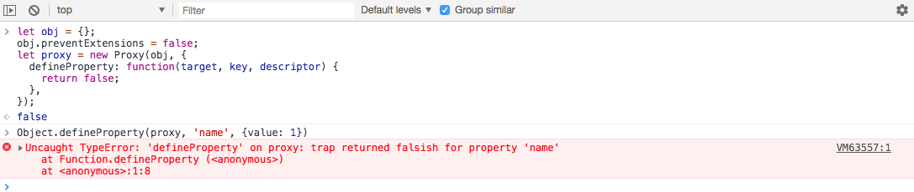
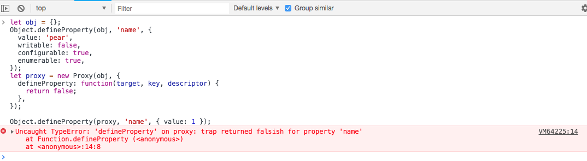
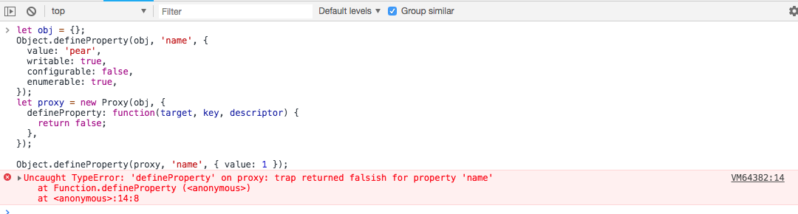

<!-- Date: 2018-07-13 12:11:21 -->

# es6 代理对象拦截器属性-defineProperty

`defineProperty`属性会拦截`通过描述属性的方式定义属性值`的操作

- Object.defineProperty(target, key, descriptor)
- Object.defineProperties(target, values)

## 参数

- `target`表示被代理的对象
- `key`表示要设置的属性名
- `descriptor`表示属性值的描述对象

## 拦截案例

```js
let obj = {};
let proxy = new Proxy(obj, {
  defineProperty: function(target, key, descriptor) {
    console.log(target === obj); // true
    console.log(key); // 'name'
    console.log(descriptor); // {value: 'pear'}
    return true;
  },
});
Object.defineProperty(proxy, 'name', {
  value: 'pear',
});
Object.defineProperties(proxy, {
  age: {
    value: 12,
  },
});
```

## 错误案例

该方法返回一个布尔值，为`true`的时候，表示设置成功，返回`false`表示设置失败。会抛出一个错误

```js
let obj = {};
let proxy = new Proxy(obj, {
  defineProperty: function(target, key, descriptor) {
    return false;
  },
});
Object.defineProperty(proxy, 'name', {
  value: 'pear',
});
// Uncaught TypeError: 'defineProperty' on proxy: trap returned falsish for property 'name'
```

如果被代理对象是不可扩展的(不能增加新的属性)，代理对象将同样不可添加属性，在使用可被拦截的操作时，会抛出错误。

> `Object.freeze(target), Object.seal(target), target.preventExtensions=false`方法都可以导致对象不可被扩展

```js
let obj = {};
obj.preventExtensions = false;
let proxy = new Proxy(obj, {
  defineProperty: function(target, key, descriptor) {
    return false;
  },
});

Object.defineProperty(proxy, 'name', { value: 1 });
// Uncaught TypeError: 'defineProperty' on proxy: trap returned falsish for property 'name'
```



如果要修改的属性，其描述对象中可覆盖(writable)`或者`可重新配置(configurable)属性为 false，使用可被拦截操作时，也会抛出错误。

```js
let obj = {};
Object.defineProperty(obj, 'name', {
  value: 'pear',
  writable: false,
  configurable: true,
  enumerable: true,
});
let proxy = new Proxy(obj, {
  defineProperty: function(target, key, descriptor) {
    return false;
  },
});

Object.defineProperty(proxy, 'name', { value: 1 });
// Uncaught TypeError: 'defineProperty' on proxy: trap returned falsish for property 'name'
```



```js
let obj = {};
Object.defineProperty(obj, 'name', {
  value: 'pear',
  writable: true,
  configurable: false,
  enumerable: true,
});
let proxy = new Proxy(obj, {
  defineProperty: function(target, key, descriptor) {
    return false;
  },
});

Object.defineProperty(proxy, 'name', { value: 1 });
// Uncaught TypeError: 'defineProperty' on proxy: trap returned falsish for property 'name'
```



与该属性相反的还有[拦截删除属性操作 handler.deleteProperty()](../es6/proxy-deleteproperty)
