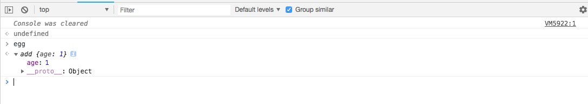
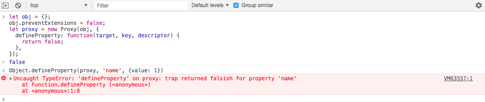
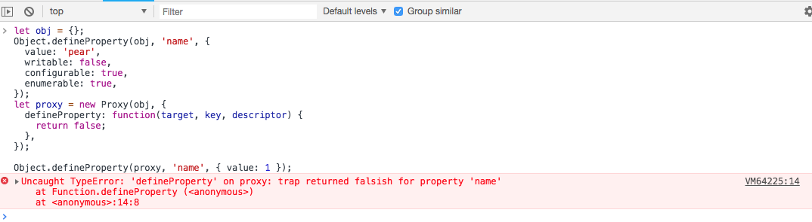
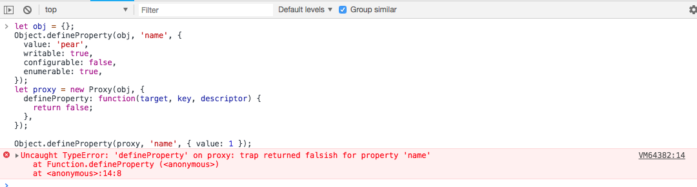

<!-- Date: 2017-11-14 19:31:21 -->

`Proxy`是 ES6 提供的新对象，用来自定义对目标的代理操作。也就是说，可以在目标的外面，设置一层“拦截”，在设置或者获取目标某些属性/方法的时候，先通过`Proxy`中定义的行为过滤和改写，再返回指定的内容。
> 本文的所有案例都在 chrome 控制台中测试

具体的用法如下：

```js
new Proxy(target, handler);
```

- target： 表示被代理的对象，该对象可以是任何数据类型
- handler：表示具体的拦截内容，以对象的形式设置不同的拦截属性

该方法，返回一个`proxy`对象， 可以通过`proxy`对象进行属性的获取、赋值等一系列操作

## handler.get(target, key, receiver)

`get`属性表示获取`proxy`的某个属性值时，必须经过的拦截规则

- `target`表示被代理的对象
- `key`表示要获取的属性值
- `receiver`表示被代理后返回的对象

```js
let obj = {
  name: 'pear',
};
let proxy = new Proxy(obj, {
  get(target, key, receiver) {
    console.log(target === obj); // true
    console.log(key); // 'name'
    console.log(receiver === proxy); // true
    return 'orange';
  },
});
console.log(proxy.name);
```

从上面的例子中，访问`name`属性的操作被拦截掉了，返回的结果被修改成了`orange`

如果要访问的属性的描述对象中可配置属性`configurable`和可改写属性`writable`都为`false`，`get`拦截器返回的值必须与`target`中的值相同，否则会抛出错误`Uncaught TypeError: 'get' on proxy: property 'name' is a read-only and non-configurable data property on the proxy target but the proxy did not return its actual value (expected 'pear' but got 'orange')`

```js
let obj = {};
Object.defineProperty(obj, 'name', {
  value: 'pear',
  configurable: false,
  writable: false,
  enumerable: true,
});
let proxy = new Proxy(obj, {
  get(target, key, receiver) {
    return 'orange';
  },
});
console.log(proxy); // Proxy {name: 'pear'}
console.log(proxy.name);
```

> MDN 上说“如果要访问的目标属性没有配置访问方法，即 get 方法是 undefined 的，则返回值必须为 undefined”。我在测试的时候，并没有发现这个限制。有兴趣的[查看完整代码](./demo/demo1.html)。或者告诉我是哪里的原因

`get`属性可以拦截以下三种方式的取值操作：

- proxy.key 或者 proxy[key]
- Reflect.get(proxy, key)
- 通过`Object.create(proxy)`创建的对象的取值操作

如果一个对象自身没有要获取的属性，而它的原型链上有一个 proxy，那么获取这个属性的时候，`proxy`的`get`属性也会被调用：

```js
let obj = {
  name: 'pear',
};
let proxy = new Proxy(obj, {
  get(target, key, receiver) {
    return 'orange';
  },
});
let egg = Object.craete(proxy);

egg.name; //'orange'
```

使用`Reflect.get()`获取属性值的时候，同样有效

```js
let obj = {
  name: 'pear',
};
let proxy = new Proxy(obj, {
  get(target, key, receiver) {
    return 'orange';
  },
});

Reflect.get(proxy, 'name'); //'orange'
```

## handler.set(target, key, value, receiver)

`set`属性，表示`proxy`在设置某个属性值的时候，必须先经过的过滤规则

- `target`表示被代理的对象
- `key`表示要获取的属性值

```js
let obj = {
  name: 'pear',
};
let proxy = new Proxy(obj, {
  set: function(target, key, value, receiver) {
    console.log(target === obj); // true
    console.log(key, value); // 'name', 'orange'
  },
});

proxy.name = 'orange';
```

`set`属性可以拦截以下几种方式的赋值操作：

- proxy.key 或者 proxy[key]
- Reflect.set(proxy, key, value)
- 通过`Object.create(proxy)`创建的对象的赋值操作

当直接对`proxy`对象进行赋值的时候，`receiver`参数表示`proxy`本身

```js
let obj = {
  name: 'pear',
};
let proxy = new Proxy(obj, {
  set: function(target, key, value, receiver) {
    console.log(receiver === proxy); // true
  },
});

proxy.name = 'orange';
```

当对象`egg`自身没有要赋值的属性，且对象的原型链上有一个`proxy`对象时，`receiver`参数指向`egg`

```js
let obj = {
  name: 'pear',
};
let proxy = new Proxy(obj, {
  set: function(target, key, value, receiver) {
    console.log(receiver === proxy); // false
    console.log(receiver === egg); // true
  },
});

let egg = Object.create(proxy);

egg.name = 'orange';
```

`set`拦截属性需要返回一个布尔值，用来告诉开发人员赋值操作是否成功。

```js
let obj = {
  name: 'pear',
};
let proxy = new Proxy(obj, {
  set: function(target, key, value, receiver) {
    target[key] = value;
    return true;
  },
});

let egg = Object.create(proxy);

let result = (egg.name = 'orange'); // true
```

在已知的赋值操作中，直接赋值的表达式会返回等号右边的值，而`Object.defineProperty(target, key, descriptor)`与`Object.defineProperties(target, key, descriptors)`返回的是 target 自身，我们可以使用`Reflect.set(target, key, value, receiver)`方法的结果来作为拦截器属性`set`的返回值

```js
let obj = {
  name: 'pear',
};
let proxy = new Proxy(obj, {
  set: function(target, key, value, receiver) {
    return Reflect.set(target, key, value);
  },
});

let egg = Object.create(proxy);

let result = (egg.name = 'orange'); // true
```

## handler.apply(target, context, argList)

`apply`属性，表示从一个函数生成的`proxy`对象被调用时被拦截的具体内容，执行后可返回任意的内容

- `target`表示被代理的对象
- `context`表示执行函数时的上下文
- `argList`表示执行函数式传入的参数，以数组形式传递

```js
let add = function() {
  console.log('add');
};
let proxy = new Proxy(add, {
  apply: function(target, context, argList) {
    console.log(target === add); // true
    console.log(context === obj); // true
    console.log(argList); // [1,2,3]
  },
});
let obj = {
  name: 'pear',
  proxy,
};
obj.proxy(1, 2, 3);
```

`apply`属性可以拦截以下几种操作：

- Function.prototype.apply(context, argList:array)
- Function.prototype.call(context, ...args)
- Reflect.apply(target, context, argList:array)

```js
let add = function() {
  console.log('add');
};
let proxy = new Proxy(add, {
  apply: function(target, context, argList) {
    retrun[(target === add, context === obj, argList)];
  },
});
let obj = {
  name: 'pear',
};
let a = proxy.call(obj, 1, 2, 3); // [true, true, [1,2,3]]
let b = proxy.apply(obj, [1, 2, 3]); // [true, true, [1,2,3]]
let c = Reflect.apply(proxy, obj, [1, 2, 3]); // [true, true, [1,2,3]]
```

`apply`属性强调被代理对象必须是一个可执行函数，否则会抛出一个错误

```js
let add = {};
let proxy = new Proxy(add, {
  apply: function(target, context, argList) {
    console.log(target === add); // true
    console.log(context === obj); // true
    console.log(argList); // [1,2,3]
  },
});
let obj = {
  name: 'pear',
  proxy,
};
obj.proxy(1, 2, 3);
// Uncaught TypeError: obj.proxy is not a function
```

## handler.construct(target, argList, newTarget)

当被代理对象是一个构造函数的时候，`construct`属性，用于拦截`new`表达式，且`必须`返回一个对象。

- `target`表示被代理的对象
- `argList`表示执行函数式传入的参数，以数组形式传递
- `newTarget`表示代理对象自身

```js
let add = function() {
  this.age = 1;
};
let proxy = new Proxy(add, {
  construct: function(target, argList, newTarget) {
    console.log(target === add); // true
    console.log(argList); // [1,2,3]
    console.log(newTarget === proxy); // true
    return new target();
  },
});
let egg = new proxy(1, 2, 3);
console.log(egg);
```



当`construct`属性返回值不是一个对象的时候，会抛出错误

```js
let add = function() {
  this.age = 1;
};
let proxy = new Proxy(add, {
  construct: function(target, argList, newTarget) {
    return 1;
  },
});
let egg = new proxy(1, 2, 3);
// Uncaught TypeError: 'construct' on proxy: trap returned non-object ('1')
```

## handler.defineProperty(target, key, descriptor)

`defineProperty`属性，表示当对代理对象使用`Object.defineProperty()`方法的时候所拦截的方法。

- `target`表示被代理的对象
- `key`表示要设置的属性名
- `descriptor`表示属性值的描述对象

```js
let obj = {};
let proxy = new Proxy(obj, {
  defineProperty: function(target, key, descriptor) {
    console.log(target === obj); // true
    console.log(key); // 'name'
    console.log(descriptor); // {value: 'pear'}
    return true;
  },
});
Object.defineProperty(proxy, 'name', {
  value: 'pear',
});
Object.defineProperties(proxy, {
  age: {
    value: 12,
  },
});
```

`defineProperty`属性可以拦截以下几种操作：

- Object.defineProperty(target, key, descriptor)
- Object.defineProperties(target, values)

该方法返回一个布尔值，为`true`的时候，表示设置成功，返回`false`表示设置失败。会抛出一个错误

```js
let obj = {};
let proxy = new Proxy(obj, {
  defineProperty: function(target, key, descriptor) {
    return false;
  },
});
Object.defineProperty(proxy, 'name', {
  value: 'pear',
});
// Uncaught TypeError: 'defineProperty' on proxy: trap returned falsish for property 'name'
```

如果被代理对象是不可扩展的(不能增加新的属性)，代理对象将同样不可添加属性，在使用可被拦截的操作时，会抛出错误。

> `Object.freeze(target), Object.seal(target), target.preventExtensions=false`方法都可以导致对象不可被扩展

```js
let obj = {};
obj.preventExtensions = false;
let proxy = new Proxy(obj, {
  defineProperty: function(target, key, descriptor) {
    return false;
  },
});

Object.defineProperty(proxy, 'name', { value: 1 });
// Uncaught TypeError: 'defineProperty' on proxy: trap returned falsish for property 'name'
```



如果要修改的属性，其描述对象中可覆盖(writable)`或者`可重新配置(configurable)属性为 false，使用可被拦截操作时，也会抛出错误。

```js
let obj = {};
Object.defineProperty(obj, 'name', {
  value: 'pear',
  writable: false,
  configurable: true,
  enumerable: true,
});
let proxy = new Proxy(obj, {
  defineProperty: function(target, key, descriptor) {
    return false;
  },
});

Object.defineProperty(proxy, 'name', { value: 1 });
// Uncaught TypeError: 'defineProperty' on proxy: trap returned falsish for property 'name'
```



```js
let obj = {};
Object.defineProperty(obj, 'name', {
  value: 'pear',
  writable: true,
  configurable: false,
  enumerable: true,
});
let proxy = new Proxy(obj, {
  defineProperty: function(target, key, descriptor) {
    return false;
  },
});

Object.defineProperty(proxy, 'name', { value: 1 });
// Uncaught TypeError: 'defineProperty' on proxy: trap returned falsish for property 'name'
```



## handler.deleteProperty(target, key)

当要删除代理对象中的某个属性时，`deleteProperty`属性中定义的拦截器会优先执行，且属性返回值必须是一个布尔值，`true` 表示删除成功，`false` 表示删除失败

- target 表示代理对象
- key 表示要删除的属性名

```js
let obj = {
  name: 'pear',
};
let proxy = new Proxy(obj, {
  deleteProperty: function(target, key) {
    console.log(target === obj); // true
    console.log(key); // 'name'
    return true;
  },
});
let result = delete obj.name; // true
```

`deleteProperty`属性用于拦截以下几种操作

- `delete target[key]`或者`delete target.key`
- `Reflect.deleteProperty(target, key)`

```js
let obj = {
  name: 'pear',
};
let proxy = new Proxy(obj, {
  deleteProperty: function(target, key) {
    return delete target[key];
  },
});
let result = Reflect.deleteProperty(proxy, 'name'); // true
```

> `delete`和`Reflect.deleteProperty(target, key)`方法都可以直接作为`handler.deleteProperty`的返回值。因为他们的返回值都是`布尔值`。且即便被删除的属性不存在，也不会抛出错误

```js
let obj = {};
let proxy = new Proxy(obj, {
  deleteProperty: function(target, key) {
    return Reflect.deleteProperty(target, key);
  },
});
let result = Reflect.deleteProperty(proxy, 'name'); // true
```

## handler.getPrototypeOf(target)

`getPrototypeOf`属性，会拦击以下几种操作， 返回值必须是一个`对象`！

- `Object.getPrototypeOf(target)`
- `Reflect.getPrototypeOf(target)`
- `target.__proto__`
- `object.isPrototypeOf(target)`
- `instanceof`

`target`参数表示被代理对象

```js
let obj = {};
let proxy = new Proxy(obj, {
  getPrototypeOf: function(target) {
    console.log(target === obj); // true
    return {};
  },
});
Object.getPrototypeOf(proxy);
```

下面是几种会被拦截的操作案例:

```js
let obj = {};
let foo = function() {};
foo.prototype.name = 'zhangsan';
foo.prototype.age = 12;
let proxy = new Proxy(obj, {
  getPrototypeOf: function(target) {
    return foo.prototype;
  },
});
console.log(
  Object.getPrototypeOf(proxy), // {name: "zhangsan", age: 12, constructor: ƒ}
  Reflect.getPrototypeOf(proxy), // {name: "zhangsan", age: 12, constructor: ƒ}
  proxy.__proto__, // {name: "zhangsan", age: 12, constructor: ƒ}
  foo.prototype.isPrototypeOf(proxy), // true
  proxy instanceof foo // true
);
```
