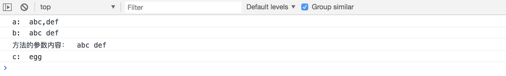

# es6-symbol-replace [Symbol.replace] 属性

之前在使用字符串的 replace 方法时，心里很明白 replace 的第一个参数，应该是一个 `string` 或者 `regexp`，从来没想过如果传入一个对象会怎么样。先来看一下正确的用法：

```js
let a = "abc def".replace(" ", ",");
a; // 'abc,def'
```

上面输出的是我们想要的结果，把字符串中的空格替换成逗号，如果把 replace 第一个参数换成对象呢

```js
var obj = {};
let a = "abc def".replace(obj, ",");
a; // 'abc def'
```

可以看到，输入内容仍然是原来的字符串，并没有发生替换操作。

[Symbol.replace]属性就指向了`String.prototype.replace`方法，如果在一个对象上部署了这个方法，这个对象也就可以作为 replace 的第一个参数了

```js
var obj = {};
obj[Symbol.replace] = function(arg) {
  return "egg";
};
let a = "abc def".replace(obj, ",");
a; // 'egg'
```

可以看到 replace 执行后返回的字符串，完全是由我们的[Symbol.replace]方法返回的内容了。

[Symbol.replace]定义的方法，默认传入一个参数，这个参数指向 replace 方法的上下文，也就是 this，在上面的案例中,arg 的内容是`abc def`

放在一起对比一下：[点击查看完整案例](./demo/demo1.html)

```js
var obj = {};
let a = "abc def".replace(" ", ",");
console.log("a: ", a);

let b = "abc def".replace(obj, ",");
console.log("b: ", b);

obj[Symbol.replace] = obj => {
  console.log("方法的参数内容： ", obj);
  return "egg";
};
let c = "abc def".replace(obj, ",");
console.log("c: ", c);
```


