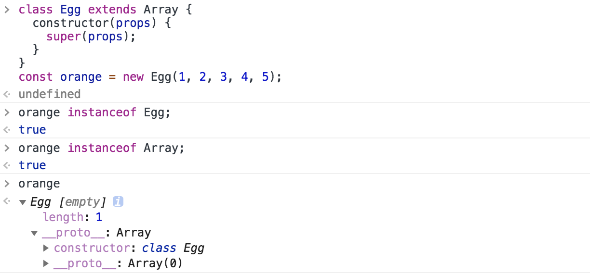
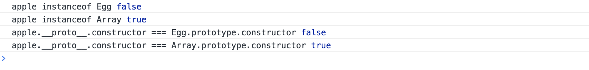
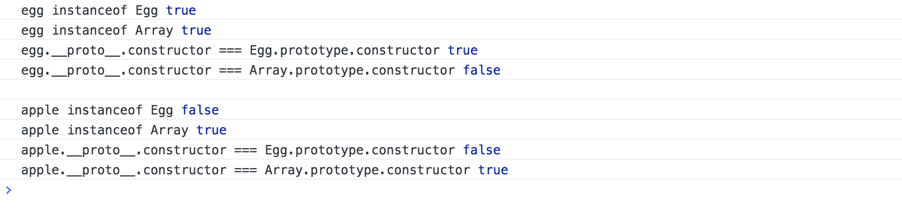

# es6-symbol-species [Symbol.species] 属性

首先看一下什么叫做“衍生对象”

```js
class Egg extends Array {
  constructor(props) {
    super(props);
  }
  static get [Symbol.species]() {
    return Array;
  }
}

const egg = new Egg(1, 2, 3);
const apple = egg.map(x => x + 1);

apple instanceof Egg; // true
apple instanceof Array; // true

apple.__proto__.constructor === Egg.prototype.constructor; // true
apple.__proto__.constructor === Array.prototype.constructor; // false
```



在上面的例子中，apple 就属于一个“衍生对象”，作为一个“衍生对象” 它不仅仅是 Egg 的实例，也是 Array 的实例。并且衍生对象的构造器函数是 Egg 而不是 Array。

有时候，我们希望衍生对象仍然只是 Array 的实例，也就是说：衍生对象的构造器函数返回的是 Array，而不是 Egg 怎么办呢？

这个时候就可以给 Egg 添加一个[Symbol.species]属性，并且返回 Array 本身来实现：[在控制台查看对比案例](./demo/demo1.html)

```js
class Egg extends Array {
  constructor(props) {
    super(props);
  }
  // 在这里添加
  static get [Symbol.species]() {
    return Array;
  }
}

const egg = new Egg(1, 2, 3);
const apple = egg.map(x => x + 1);

apple instanceof Egg; // false
apple instanceof Array; // true

apple.__proto__.constructor === Egg.prototype.constructor; // false
apple.__proto__.constructor === Array.prototype.constructor; // true
```



要注意的是：这个[Symbol.species]属性只对“衍生对象”有效，子类生成的对象实例是无效的。 [在控制台查看完整案例](./demo/demo1.html)

```js
class Egg extends Array {
  constructor(props) {
    super(props);
  }
  // 在这里添加
  static get [Symbol.species]() {
    return Array;
  }
}

const egg = new Egg(1, 2, 3);
const apple = egg.map(x => x + 1);

egg instanceof Egg; // true
egg instanceof Array; // true
egg.__proto__.constructor === Egg.prototype.constructor; // true
egg.__proto__.constructor === Array.prototype.constructor; // false

apple instanceof Egg; // false
apple instanceof Array; // true
apple.__proto__.constructor === Egg.prototype.constructor; // false
apple.__proto__.constructor === Array.prototype.constructor; // true
```


