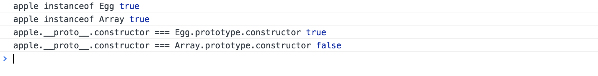

<!-- # es6-symbol 中的[Symbol.species]属性 -->

```js
class Egg extends Array {
  constructor(props) {
    super(props);
  }
}

const egg = new Egg(1, 2, 3);
const apple = egg.map(x => x + 1);

apple instanceof Egg; // true
apple instanceof Array; // true

class Egg extends Array {
  constructor(props) {
    super(props);
  }
  static get [Symbol.species]() {
    return Array;
  }
}

const egg = new Egg(1, 2, 3);
const apple = egg.map(x => x + 1);

apple instanceof Egg; // true
apple instanceof Array; // true
```

在上面的例子中，apple 就属于一个“衍生对象”，作为一个“衍生对象” 它不仅仅是 Egg 的实例，也是 Array 的实例
先看看下面的例子

```js
class Egg extends Array {
  constructor(props) {
    super(props);
  }
}
const egg = new Egg(1, 2, 3, 4, 5);
const apple = egg.map(x => x + 1);

apple instanceof Egg; // true
apple instanceof Array; // true
apple.__proto__.constructor === Egg.prototype.constructor; // true
apple.__proto__.constructor === Array.prototype.constructor; // false
```



在上面例子中，Egg 是 Array 的子类，所以 orange 既是 Egg 的实例，又是 Array 的实例。在浏览器的输出中可以看出,orange 的构造函数是`Egg`,但有时我们不希望她的构造函数时 Egg，想把它改成 Array 怎么办呢？

在构造函数的继承一文中，在通过 prototype 直接继承另一个对象后，我们会通过修改`prototype.constructor`来改变子类的构造器函数，本文的[Symbol.species]与这个直接修改构造器函数的功能是一致的。

```js
class Apple extends Array {
  constructor(props) {
    super(props);
  }
  static get [Symbol.species]() {
    return Array;
  }
}
const apple = new Apple(1, 2, 3, 4, 5);

apple instanceof Apple; // false
apple instanceof Array; // true
apple.__proto__.constructor === Apple.prototype.constructor; // false
apple.__proto__.constructor === Array.prototype.constructor; // true
```
