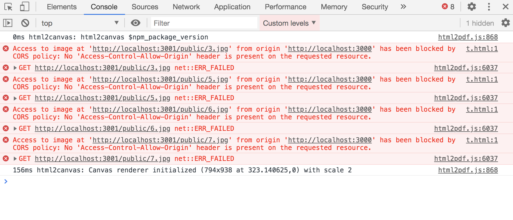

<!-- Date: 2020-08-25 16:45 -->

# html2pdf 插件中遇到的跨域问题(不同源的图片绘制不出来)

最近在某个项目中遇到以下需求：截取页面中的一部分文字和图片内容，生成一个 pdf 文件，并提供用户下载，通过查找，发现了 3 个实现该功能的插件：`html2canvas`、`jspdf`和`html2pdf`。

其中`html2canvas`的作用是把页面内容转成一个`canvas`实例,`jspdf`则是通过 JS 把指定格式的内容扔进一个 pdf 中，并自动弹框提供下载。

`html2pdf`则是`html2canvas`、`jspdf`两者的结合体，所以直接使用`html2pdf`插件就可以了。

## 先说简单的案例

假如我通过`http://localhost:3000/t.html`访问`t页面`，页面内容如下：

```html
<button class="pdf">生成pdf</button>
<script src="./html2pdf.bundle.js"></script>
<div class="pdfContent">
    <h1>title</h1>
    
    
    
</div>
```

并根据`html2pdf`官方手册使用如下代码：

```js
window.onload = function () {
    documen.querySelector('.pdf').onclick = function () {
        const element = document.querySelector('#pdfContent');
        html2pdf().from(element).save();
    };
};
```

这么写是完全没问题的，完美根据我的内容生成了一个 pdf 文件。

但是：我所在的是 vue 项目，vue 项目中大部分图片都牵扯到跨域，也就是说图片资源和页面资源很大可能不会放在同一个域名找下，HTML 部分代码就会是这样的：

```html
<script src="./html2pdf.bundle.js"></script>
<div class="pdfContent">
    <h1>title</h1>
    
    
    
</div>
```

此时再次点击按钮，会发现控制台报了一大堆 CORS 错误：并且，提供下载的 pdf 文件尺寸明显比上次的小了很多，打开后会发现 DOM 中的图片都没显示在 pdf 文件中了。


我们先解决 CORS 问题，在服务器上添加允许 CORS 的配置(我这里是 express 临时启动的服务器，配置如下):

```js
app.get('*', (req, res) => {
    res.header('Access-Control-Allow-Origin', '*'); // 这里是重点
    const file = path.resolve(__dirname, '.' + req.path);
    res.sendFile(file);
});
```

添加 CORS 配置后，再次刷新页面点击按钮，这没有 CORS 的错误提示了，但下载后的文件中依然没有图片，这是为什么呢？

[html2canvas 官网](http://html2canvas.hertzen.com/documentation)中有这么一段话：

> All the images that the script uses need to reside under the same origin for it to be able to read them without the assistance of a proxy. Similarly, if you have other canvas elements on the page, which have been tainted with cross-origin content, they will become dirty and no longer readable by html2canvas.

大概的意思就是说(翻译不准的地方请忽略我蹩脚的英文)：

> 该插件所使用的图片都需要保证“同源”才能被正确的处理，如果你页面中有其他的非同源元素，他们将不会被 html2canvas 插件获取到，

就是说虽然我们设置了 CORS，但是图片的 host`http://localhost:3001`和我们当前页面的访问 host`http://localhost:3000`不一致。

解决方案在`html2canvas`的[配置信息](http://html2canvas.hertzen.com/configuration)中，有这么一个配置参数`useCORS`，现在再来修改一下 JS 代码，**注意在`html2pdf`中设置`html2canvas`参数的方式**

```js
window.onload = function () {
    documen.querySelector('.pdf').onclick = function () {
        const element = document.querySelector('#pdfContent');
        html2pdf()
            .set({
                html2canvas: {
                    useCORS: true,
                },
            })
            .from(element)
            .save();
    };
};
```

再来点击一下按钮，现在又是我们想要的结果了

## 题外话

`html2canvas`的[配置项](http://html2canvas.hertzen.com/configuration)中有一个`allowTaint`参数，我单独用它来把页面内容渲染成一个`canvas`是成功的，图片都能被正确的渲染到 canvas 中，但是在`html2pdf`中，却没有下载的弹窗提示，据说是因为`canvas`内容被污染了，无法执行`canvas.toDataURL()`方法，我也没找到具体的原因，以后有时间再回来看看。

```js
window.onload = function () {
    document.querySelector('button').onclick = function () {
        var element = document.querySelector('.wrapper');
        html2canvas(element, {
            allowTaint: true,
        }).then((canvas) => {
            document.body.append(canvas);
        });
    };
};
```
