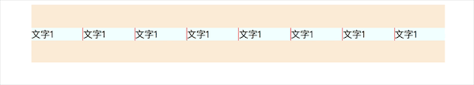

<!-- Date: 2020-11-09 15:05 -->

# 文字重复滚动效果



[案例源码](./demo/index.html)

## 重点

这段源码中需要注意 2 个地方：

1. 由于为`.container`添加的动画结束事件是放在`animate`函数内部的，所以它必须是一次性事件，否则每次执行`animate`函数，都会为`.container`元素添加一个动画结束的监听事件，会导致`animate`函数执行次数倍增

2. 动画结束事件中，再次执行`animate`函数时，必须强制页面重绘一次，否则会导致动画停止，这里的强制页面重绘，可以使用任何能导致页面重绘的方法，不一定非要使用`offsetWidth`

## 另一种不必设置一次性事件的案例

如果不想设置一次性事件，可以把事件放到`animate`函数外部

```js
window.onload = function () {
    // 获取每一个span元素的宽度，将作为动画的最终位置
    const firstElementWidth = document.querySelector('span').offsetWidth;
    const containerEle = document.querySelector('.container');

    containerEle.addEventListener('transitionend', function () {
        console.log('end');
        containerEle.style.transition = 'none';
        containerEle.style.left = '0px';
        console.log(containerEle.offsetWidth); // 这句话很重要,千万不能没有
        animate();
    });
    animate();
    function animate() {
        containerEle.style.transition = 'all 5s linear';
        containerEle.style.left = -firstElementWidth + 'px';
    }
};
```
