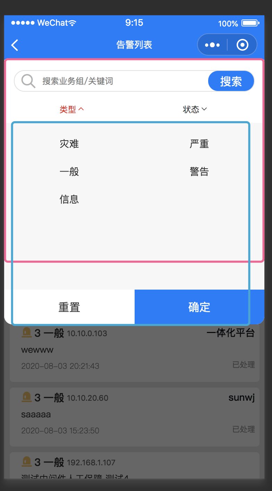

<!-- Date: 2020-08-12 15:16 -->

# uniapp 中 px 单位转 rpx 的问题

当需要某元素的单位要根据屏幕宽度大小变化时，uniapp 项目中推荐使用`rpx`作为单位，但是我碰到了有一个问题，在使用`tui-top-dropdown`组件时，需要根据指定元素位置，计算组件的 translateY 高度，以便组件显示在正确位置，像这样（红线是组件原本的位置，绿线是希望它移动后的距离）：

这个时候就需要计算移动位置的高度，可以使用 uniapp 提供的 api

```js
let seaerchEle = uni.createSelectorQuery().select('.tui-header-screen');
seaerchEle
    .boundingClientRect(function (data) {
        // data中包含了元素的尺寸属性值，但是要注意，该方法必须放在mounted函数中，才能正确获取
    })
    .exec();
```

注意，上面回调函数中的 data 所获取到的尺寸单位都是`px`，但是`tui-top-dropdown`组件要求传递的`props.translatey`接收一个数字作为参数，且它的单位是`rpx`，这个时候就需要把`px`转为`rpx`才能传递给组件，那么怎么把`px`转为`rpx`呢？

首先 uniapp 中默认把整个屏幕宽度算作`750rpx`，也就是说不管你的屏幕实际宽度多少，它都会以`750rpx`为参考去计算最终元素的`px`值。假设我现在用的是 iphone8，屏幕宽度为`375px`，假设我想要移动的距离为`90px`,就有了这么一个公式：

```
750rpx       ?
-----   =  -----          //  ? = 90 * 750 / 375
375px       90px
```

注意这里有 2 个变量，第一个是要移动的距离，第二个是屏幕的宽度，并不是所有机型的宽度都是`375px`，所以我们要获取到不同机型的屏幕宽度，这里 uniapp 也给我们提供了一个 api：

```js
uni.getSystemInfo({
    success: (res) => {
        // 这里的res包含了当前系统的很多信息，这其中就包含了屏幕宽度、高度，可用宽度、高度等尺寸
    },
});
```

现在我们知道怎么去计算要移动的距离了：

```js
uni.getSystemInfo({
    success: (res) => {
        let seaerchEle = uni.createSelectorQuery().select('.tui-header-screen');
        seaerchEle
            .boundingClientRect(function (data) {
                // 想要的rpx值 = data.heght*750/res.window.width
            })
            .exec();
    },
});
```
