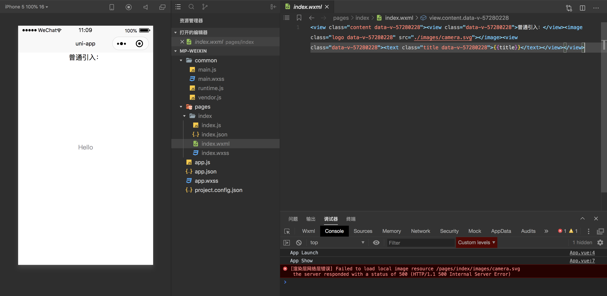
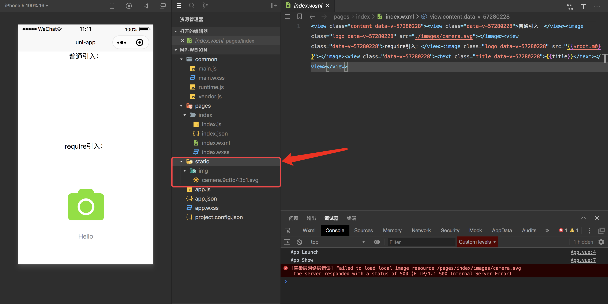

<!-- Date: 2020-09-22 11:15 -->

# uniapp 项目 build 后访问不到图片的问题

以前的项目中，一般都会把静态资源放在一个叫做`static`的文件夹中，有一个很大的弊端就是，如果哪个页面不需要了，根本不知道和该页面关联的图片有哪些，万一删错影响了其他页面就 GG 了。

所现在什么都在讲组件化，项目中的每个页面也都可以看错一个组件，我操作的项目中只要和当前页面有关的，都会和页面文件放在一起，比如：

```
pages
|---index
    |---index.vue
    |---index.scss
    |---index.js
    |---images
    |   |---logo.svg
```

假设在 index.vue 中，我想引入一张图片：

```html
<image class="logo" src="./images/logo.png"></image>
```

这张图片在`npm run serve`(也就是`npm run dev:h5`)模式下显示正常，在微信小程序`npm run dev:mp-weixin`上直接报错 404 了，看了一下打包后的`mp-weixin`目录，如下所示：



发现 images 丢了，图片的路径错了，肯定是访问不到的。

## 解决方案一

最快的方案就是把引入方式改为：

```html
<image class="logo" src="/static/images/index/logo.png"></image>
```

啥意思，其实就是修改了引入路径，把所有的图片放入`/static/images/`目录下，并且按页面分类存放。引入的时候，也从`/static`开始引入，虽然展示正常，但这不是我想要的，我就是喜欢把图片和页面放在一起怎么办？

## 解决方案二

还是修改一下图片的引入方式：

```html
<image class="logo" src="require('./images/logo.png')"></image>
```

UNI-APP 本身用了`webpack`作为打包工具，`require`引入的资源会被打包并且拥有一个唯一的 hash 值，编译到微信小程序平台后，会发现:



注意看，编译后的目录多了一个`/static/img`目录，看到这个目录内的文件后缀，熟悉`webpack`的同学差不多就明白是怎么来的了。再看看我引入图片的代码被编译成什么了：

```html
<!-- index.wxml -->
<image class="logo data-v-57280228" src="{{$root.m0}}"></image>
```

```js
// index.js
var m0 = __webpack_require__(/*! ./images/camera.svg */ 20);

_vm.$mp.data = Object.assign(
    {},
    {
        $root: {
            m0: m0,
        },
    }
);
```

看到这里就不用多说了。如果看不明白说明你得去学习一下`webpack`了
